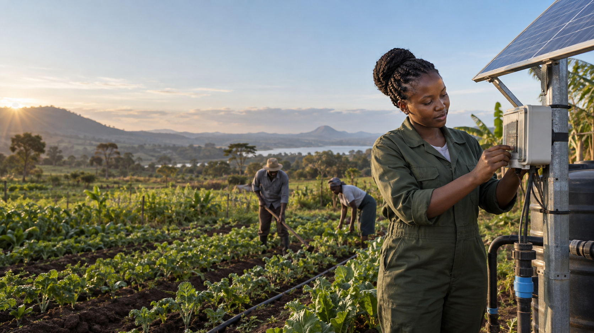
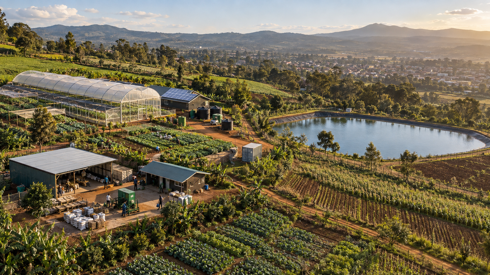

# KCIC Homepage Hero Concepts

## Recommendation

Start with **Concept 1: People + Progress**.

It explains KCIC fastest because the visitor sees all three parts of the story in one frame: a Kenyan innovator, practical climate technology, and the community or landscape that benefits. It also gives the homepage an emotional point of view without weakening KCIC's institutional credibility.

## What current climate and impact websites do well

The strongest patterns from the reviewed websites are:

- A short positioning statement that a visitor can understand in a few seconds.
- One decisive image rather than a busy slideshow.
- A primary action tied to the visitor's intent.
- Real people, real technology, or a specific place instead of generic sustainability symbolism.
- Evidence of impact close to the opening message, using dated and verified figures.

Climate KIC leads with a compact statement of authority: “Europe's leading climate innovation agency and community.” Acumen leads with a short human purpose: “Investing in dignity.” GSMA ClimateTech pairs a clear promise about a low-carbon, climate-resilient future with specific climate-technology imagery. These are useful principles for KCIC, but the visual expression should remain distinctly Kenyan and follow the KCIC brand system.

Research references:

- [Climate KIC](https://www.climate-kic.org/)
- [Acumen](https://acumen.org/)
- [GSMA ClimateTech](https://www.gsma.com/solutions-and-impact/connectivity-for-good/mobile-for-development/climatetech/)
- [Global Innovation Fund](https://www.globalinnovation.fund/)
- [Mercy Corps Ventures](https://www.mercycorps.org/en-gb/what-we-do/ventures)

## Concept 1: People + Progress

### Core idea

Make the innovator the face of KCIC. The image shows a real solution in use, while the landscape explains why the work matters.

### Suggested headline

> Catalysing climate entrepreneurship.

Supporting copy:

> We help climate entrepreneurs develop, commercialize, and scale solutions that build sustainable enterprises and climate-resilient communities.

Primary action: **Explore our programmes**  
Secondary action: **See our impact**

Optional proof strip, after KCIC confirms definitions and a common reporting date: **3,500+ SMEs supported · 57,517 jobs created · USD 63M leveraged**.

### Layout

- Use a full-width image at approximately 78-86% of the visible screen height.
- Keep the innovator and solar equipment on the right.
- Place the copy on the left in a constrained column.
- Use a dark charcoal-to-transparent image overlay behind the text.
- Add one restrained KCIC-green arc entering from the lower-left edge.
- Place a slim proof strip directly beneath the hero with two or three verified, dated impact figures.
- Keep the new floating header above the image.

### Motion

- Use a slow, subtle image scale from 1.02 to 1 on first load.
- Reveal the headline and actions as one coordinated sequence.
- Disable the scale and reveal movement when reduced motion is enabled.

### Why it works

- Human and immediately understandable.
- Connects innovation to outcomes in one image.
- Works for entrepreneurs, partners, and funders.
- The subject placement leaves a reliable area for desktop copy.

### Watch-outs

- KCIC should replace the concept image with approved documentary photography if suitable photography exists.
- The mobile crop needs a dedicated art direction so the innovator and equipment remain visible.
- The impact strip must use verified figures with a reporting date.

## Concept 2: The Innovation Landscape

### Core idea

Show KCIC as the organization connecting multiple systems: enterprise, agriculture, energy, water, communities, and scale.

### Suggested headline

> Where climate ideas become scalable solutions.

Supporting copy:

> We support innovators, strengthen enterprises, and build partnerships that move Kenya's climate solutions from possibility to impact.

Primary action: **Discover our work**  
Secondary action: **Meet our innovators**

### Layout

- Use the aerial image across the full hero.
- Place the headline in a clean white panel aligned to the right, covering no more than 38% of the frame.
- Let a large cropped KCIC-green circle sit partly behind the panel as the main brand gesture.
- Add a small sector navigator along the lower edge: energy, agriculture, water, circular economy, and approved additional sectors.
- On mobile, move the text panel below a landscape crop instead of placing long text over the image.

### Motion

- Use a gentle reveal that traces the relationship between two or three sector labels and areas of the image.
- Keep the labels informational and avoid map pins that imply exact geographic locations.
- Do not autoplay a pan or create scroll-jacking behavior.

### Why it works

- Presents KCIC as a systems-level organization.
- Feels ambitious and institutional.
- Makes a natural bridge into the Key Sectors and Our Work sections.
- The image carries breadth without using a collage.

### Watch-outs

- It is less emotionally immediate than Concept 1.
- The landscape should be an actual KCIC-supported location before publication.
- Sector labels need to come from the approved KCIC sector taxonomy.

## Concept 3: Built by Innovators

### Core idea

Position KCIC as the place where ambitious founders get practical support to build, test, finance, and scale climate solutions.

### Suggested headline

> Backing the people solving Kenya's climate challenges.

Supporting copy:

> From early ideas to growing enterprises, KCIC gives climate innovators the expertise, networks, and support they need to move forward.

Primary action: **Find the right programme**  
Secondary action: **How KCIC supports innovators**

### Layout

- Use the workshop image edge to edge.
- Place the copy on the quieter right side inside a dark translucent circle or controlled charcoal overlay.
- Use the KCIC cyan as a small technical accent in link arrows, focus states, or a thin rule.
- Add one short programme or open-call message at the bottom only when it is current and editorially important.
- On mobile, crop around the lead founder and place the text in a solid charcoal section beneath the image.

### Motion

- Use a short clip reveal that opens from the KCIC brandmark shape or a simple circular mask.
- Keep the final state still so the team and prototype remain easy to study.
- Avoid animated technical diagrams over the people.

### Why it works

- Speaks directly to KCIC's entrepreneur audience.
- Feels energetic, practical, and future-facing.
- Makes programmes and applications the natural first action.
- Differentiates KCIC from sites that rely mainly on landscapes.

### Watch-outs

- The clean-tech prototype and people must correspond to a real KCIC story before publication.
- The visual is narrower in scope than Concept 2, so the supporting copy must mention wider community and climate outcomes.

## Comparison

| Direction            | First impression                      | Strongest audience      | Main strength                                    | Main risk                                     |
| -------------------- | ------------------------------------- | ----------------------- | ------------------------------------------------ | --------------------------------------------- |
| People + Progress    | Human, grounded, hopeful              | Broad audience          | Explains people, technology, and impact together | Needs excellent documentary photography       |
| Innovation Landscape | Ambitious, connected, systemic        | Partners and funders    | Shows the breadth of KCIC's work                 | Can feel distant without a human story        |
| Built by Innovators  | Energetic, practical, entrepreneurial | Founders and applicants | Makes KCIC's innovation support tangible         | Can make the organization appear startup-only |

## Shared implementation rules

- Use a single static hero story rather than an automatic carousel.
- Keep the headline to roughly 5-10 words and supporting copy to 20-35 words.
- Use no more than two hero actions.
- Ensure the primary purpose remains clear before scrolling.
- Keep text readable at 320px width and 200% zoom.
- Supply separate desktop and mobile crops or image focal points.
- Compress and responsively serve the image; prioritize the hero image for loading.
- Use authentic, rights-cleared KCIC photography for launch.
- Put evidence near the hero, but only after figures and dates are verified.
- Treat the generated images in this document as art-direction references, not documentary evidence or final publication photography.
